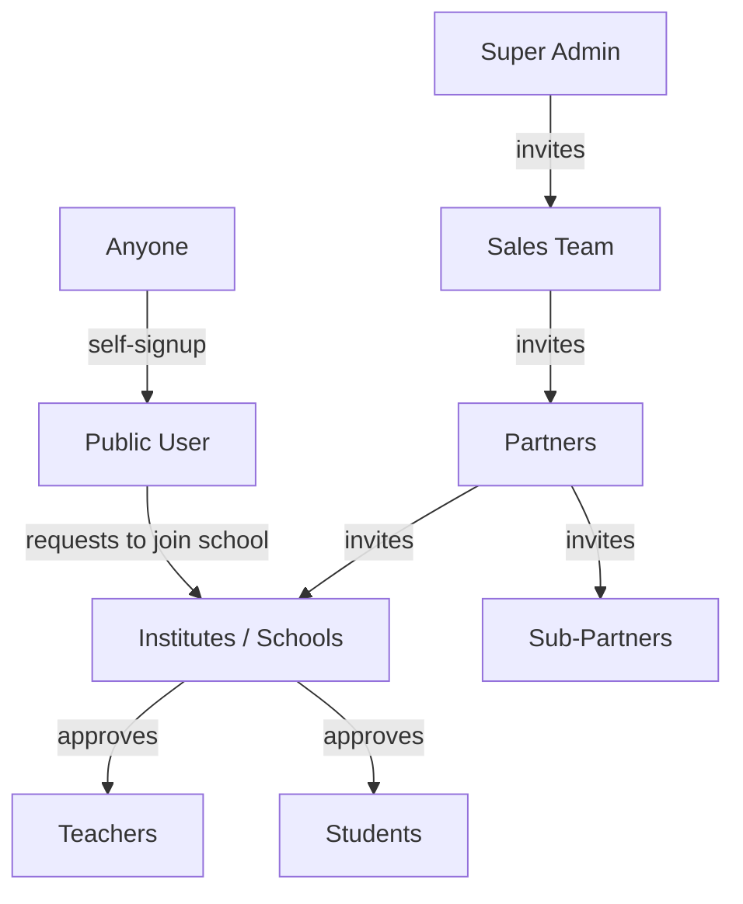

# Welcome to TinkerBunker

> Your all-in-one platform for learning, teaching, and managing education.

---

## Pick Your Role

| | Role | What You Do | Start Here |
|---|---|---|---|
| 🎓 | **Student** | Learn courses, take tests, earn certificates | [Student Guide](student/dashboard.md) |
| 👩‍🏫 | **Teacher** | Create tests, manage classrooms, track students | [Teacher Guide](teacher/dashboard.md) |
| 🏫 | **Institute** | Run your school — classrooms, teams, approvals | [Institute Guide](institute/dashboard.md) |
| 👨‍👩‍👧 | **Guardian** | Monitor your child's learning progress | [Guardian Guide](guardian/getting-started.md) |
| 🤝 | **Partner** | Manage schools, licenses, and billing | [Partner Guide](partner/dashboard.md) |
| 🌐 | **Public** | Browse courses and verify certificates | [Public Access](public/browsing-courses.md) |

---

## New Here?

1. **Create your account** → [Sign Up](getting-started/signing-up.md)
2. **Already have an account?** → [Log In](getting-started/logging-in.md)
3. **Need help?** → [FAQ](common/faq.md)

---

## How Users Join TinkerBunker


Students and Teachers can self-register, but need their institute to approve them.

