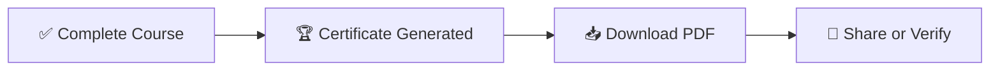

# 🏆 Certificates

Earn a certificate when you complete a course.

---

## Flow

---

## Key Points

- Certificates are generated **automatically** on course completion
- Each certificate has a **unique UUID**
- Download as **PDF** anytime from your dashboard
- Anyone can **verify** a certificate using the UUID

---


Partners can customize certificate designs with white labeling.

