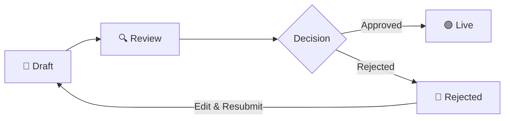

# 📚 Course Lifecycle

Every course moves through a review process before going live.

---

## Flow

---

## Who Does What

| Stage | Role |
|-------|------|
| **Draft** | Teacher creates the course |
| **Review** | Institute or Partner reviews it |
| **Approved / Rejected** | Reviewer decides |
| **Live** | Students can now enroll |

---


Rejected courses can be edited and resubmitted.

