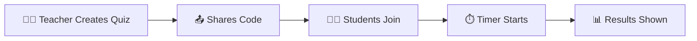

# 🎯 Live Remote Quiz

Real-time quizzes where students compete live.

---

## How It Works

---

## Key Points

- Teacher sets questions and time limit
- Students join using a **session code**
- Everyone answers at the same time
- Scores appear instantly on a **leaderboard**

---


Great for classrooms, webinars, and competitions.

