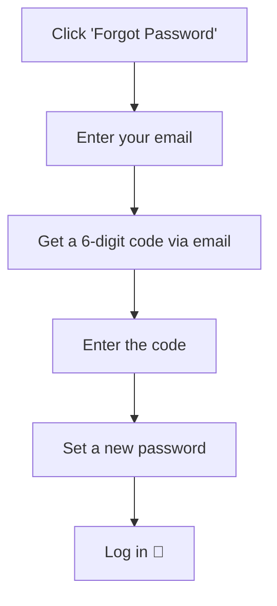

# Forgot Password

> Reset your password in 4 steps. No login needed.

---

## How It Works

---

## 4 Steps to Reset

1. 🔗 Click **Forgot Password?** on the login page
2. 📧 Enter your **email** and hit **Send OTP**
3. 🔢 Open the email, grab the **6-digit code**, enter it
4. 🔑 Type your **new password**, confirm it, hit **Reset**

That's it. Now [log in](logging-in.md) with your new password.


The code expires in 10 minutes. If it doesn't arrive, check spam or resend.


---

## 🔧 Trouble?

| Problem | Fix |
|---|---|
| No email received | Check spam. Verify the email address. Wait and resend |
| Code expired | Click **Resend OTP** to get a new one |
| Code not working | Make sure you're using the latest code |
| Account not found | You may have signed up with Google — try that instead |

---

## Next Steps

→ [Log in to your account](logging-in.md)
→ [Back to overview](overview.md)
