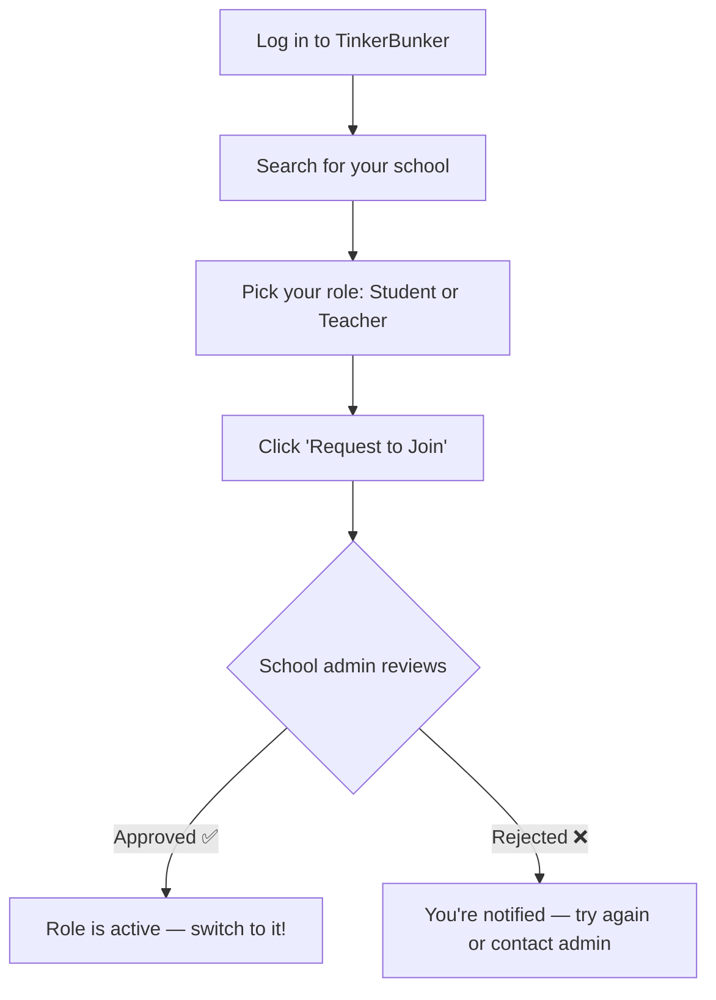

# Join an Institute

> Already have an account? You can join a school without making a new one.

---

## How It Works

---

## 4 Steps to Join

1. 🔑 **Log in** to your account
2. 🔍 Go to your profile and **search for the school**
3. 🎭 Pick your role — **Student** or **Teacher**
4. 📤 Click **Request to Join** and wait


You don't need a new account. The school role gets added to your existing one.


---

## What Happens Next?

| Stage | What You See |
|---|---|
| ⏳ Pending | "Pending Approval" badge on the role |
| ✅ Approved | Role becomes active — find it in your [role switcher](role-switching.md) |
| ❌ Rejected | You're notified. Contact the school admin if needed |


While pending, you can't access that school's classrooms or courses. Your other roles aren't affected.


---

## Can I Join Multiple Schools?

Yes! No limit. Each school role is independent.

- Student at School A + Teacher at School B = totally fine
- Each shows up separately in your role switcher

---

## Next Steps

→ [Switch to your new role](role-switching.md)
→ [Student Dashboard](../student/dashboard.md)
→ [Teacher Dashboard](../teacher/dashboard.md)
