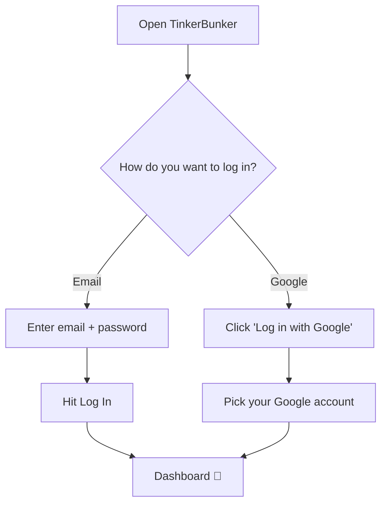

# Log In

> Get back into your account in seconds.

---

## How It Works

---

## 📧 Email + Password

1. Enter your **email** and **password**
2. Click **Log In**
3. You land on your dashboard

---

## 🔵 Google Login

1. Click **Log in with Google**
2. Pick your Google account — done!


If you have multiple roles, you'll land on the one you used last. Switch anytime from the profile menu.


---

## 🔧 Trouble Logging In?

| Problem | Fix |
|---|---|
| Wrong password | Check for typos. Passwords are case-sensitive. [Reset it](forgot-password.md) |
| Account not found | Make sure you're using the right email |
| Email not verified | Check your inbox for the verification email |
| Pending approval | Ask your school admin to approve your account |
| Google not working | Enable third-party cookies or try another browser |

---

## Next Steps

→ [Forgot your password?](forgot-password.md)
→ [Switch between roles](role-switching.md)
→ [Join a school](joining-an-institute.md)
