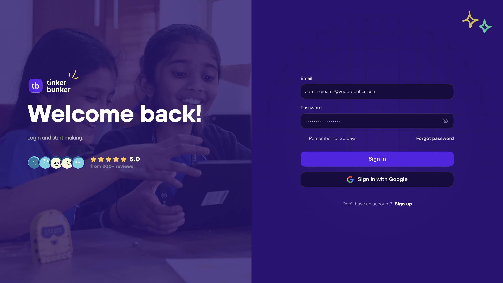

# Logging In

Once your account is created and verified, you can log in to TinkerBunker using your email and password or through Google OAuth.

---

## Login Methods

### Email and Password

1. Navigate to `/login`.
2. Enter your **email address** and **password**.
3. Click **Log In**.
4. On success, you are redirected to your role-specific dashboard.


If your account has multiple roles, you will land on the dashboard of your **most recently active role**. You can switch roles at any time from the profile menu. See [Switching Roles](role-switching.md) for details.


### Google OAuth

1. Navigate to `/login`.
2. Click **Log in with Google**.
3. Select your Google account from the OAuth prompt.
4. If your Google email matches an existing TinkerBunker account, you are logged in directly.
5. If no account exists for that email, a new account is created automatically and you are redirected to the dashboard.


Google OAuth only works if your Google account email matches the email you used during signup. If you signed up with a different email, use the email-and-password method instead.


---

## After Login: Redirect Behavior

Where you land after login depends on your account state:

| Account State | Redirect Destination |
| --- | --- |
| Single role assigned | Dashboard for that role |
| Multiple roles assigned | Dashboard of last active role |
| Institute signup, pending approval | Pending approval screen |
| No roles assigned | Role selection / onboarding screen |

---

## Staying Logged In

TinkerBunker uses session tokens to keep you logged in across browser sessions. You will remain logged in until:

- You explicitly click **Log Out** from the profile menu.
- Your session token expires (after extended inactivity).
- You clear your browser cookies.


For shared or public computers, always log out manually using the **Log Out** button in the profile dropdown to prevent unauthorized access.


---

## Login Troubleshooting

| Issue | Solution |
| --- | --- |
| Incorrect password | Double-check for typos. Passwords are case-sensitive. Use [Forgot Password](forgot-password.md) to reset. |
| Account not found | Verify you are using the same email you signed up with. Check if you used Google OAuth instead. |
| Email not verified | Check your inbox for the verification email. Request a new one from the login error screen. |
| Pending institute approval | Contact your institute administrator to approve your account. |
| Google OAuth fails | Ensure third-party cookies are enabled. Try a different browser. |

---

## Next Steps

- [Forgot your password?](forgot-password.md)
- [Switch between roles](role-switching.md)
- [Join an institute](joining-an-institute.md)
