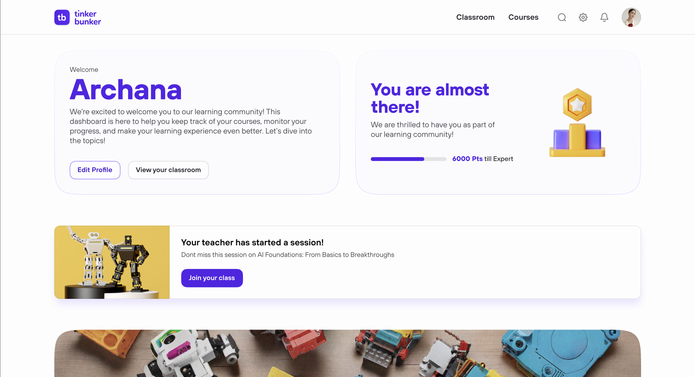

# Platform Overview

TinkerBunker is an EdTech platform built to manage the complete educational lifecycle -- from course creation and publishing to classroom management, testing, certification, and institutional administration.

The platform serves schools, training centers, coaching institutes, and educational organizations of all sizes. It connects students, teachers, administrators, partners, and guardians within a unified system.

<figure><figcaption></figcaption></figure>

---

## Core Capabilities

| Capability | Description |
| --- | --- |
| Course Management | Create, review, publish, and distribute courses across institutions |
| Classroom Management | Organize students and teachers into classrooms with assigned coursework |
| Test System | Build timed tests with auto-grading, analytics, and remote quiz sessions |
| Certification | Auto-generate certificates upon course completion with public verification |
| Institutional Administration | Manage teams, approve users, control access, and monitor performance |
| Partner & Sales Network | Distribute courses through partners with seat licensing and billing |
| White Labeling | Custom branding for partners and institutes |

---

## Platform Roles

TinkerBunker supports **11 distinct roles**, each with specific permissions and capabilities. A single user account can hold multiple roles simultaneously.

| Role | Who Is It For? | Key Capabilities |
| --- | --- | --- |
| **Public** | Anyone without an account | Browse published courses, verify certificates |
| **Student** | Learners | Enroll in courses, take tests, earn certificates, track progress |
| **Teacher** | Educators and instructors | Manage classrooms, create tests, assign courses, run remote quizzes |
| **Institute Admin** | School or organization admins | Manage classrooms, approve users, oversee teams, view institute-wide stats |
| **Guardian** | Parents or mentors | Link to student accounts, monitor learning progress and performance |
| **Partner** | Distribution partners | Manage schools, sub-partners, seat licensing, billing, and coupons |
| **Sub-Partner** | Regional or local distributors | Manage a subset of schools under a parent partner |
| **Sales** | TinkerBunker sales team | Manage partner relationships, coupons, and pricing |
| **Admin Creator** | Content authors | Create and manage course content, lessons, and media |
| **Admin Publisher** | Content reviewers | Review, approve, and publish courses to the marketplace |
| **Super Admin** | Platform administrators | Full platform control -- courses, categories, users, and system settings |


**Team Members** are not a standalone role. Partners, Sales, Institutes, and Admin Creators can invite team members who inherit a scoped set of permissions from the parent role.


---

## How the Platform Works

### For Learners

1. **Sign up** as a Student via Institute signup (select your school) or get invited by your institute.
2. **Wait for approval** from your institute administrator.
3. **Browse and enroll** in available courses (free or paid).
4. **Complete lessons**, take tests, and track your progress on the dashboard.
5. **Earn certificates** upon course completion -- certificates are publicly verifiable.

### For Educators

1. **Sign up** as a Teacher via Institute signup (select your school) or get invited by your institute.
2. **Wait for approval** from your institute administrator.
3. **Create or join classrooms** and manage student groups.
4. **Browse the course catalog** and assign courses to classrooms.
5. **Create tests** and run live remote quiz sessions.
6. **Track student performance** through the stats dashboard.

### For Institutions

1. **Receive an invitation** from a Partner (institutes cannot self-register).
2. **Accept the invitation** via the email link and complete your profile.
3. **Approve teachers and students** who request to join your institute.
4. **Create classrooms**, assign teachers, and manage coursework.
5. **Monitor performance** across all classrooms and members.

### For Partners and Sales

1. **Sales** members are invited by Admin Publishers -- they manage partner relationships, coupons, and pricing.
2. **Partners** are invited by Sales -- they onboard schools, manage seat licensing, sub-partners, and billing.
3. **Sub-Partners** are invited by Partners -- they handle regional distribution under a parent partner.


**Invitation Chain:** Super Admin/Admin Publisher invites Sales invites Partners invites Institutes. Students and Teachers self-register under an Institute but require approval. See [Signing Up](signing-up.md) for full details.


### For Content Teams

1. **Admin Creators** are assigned internally -- they build courses with lessons, media, and assessments.
2. **Admin Publishers** are assigned internally -- they review submitted courses and publish approved content.
3. **Super Admins** have full platform control and manage the course catalog, categories, and system settings.

---

## Public Access

Certain pages are accessible without logging in:

| Route | Purpose |
| --- | --- |
| `/login` | Sign in to the platform |
| `/forgotpassword` | Reset your password via OTP |
| `/verify-certificate` | Verify the authenticity of a certificate using its unique code |

---

## Next Steps

- [Sign up for an account](signing-up.md)
- [Log in to TinkerBunker](logging-in.md)
- [Explore the Role Access Matrix](../features/role-access-matrix.md)
