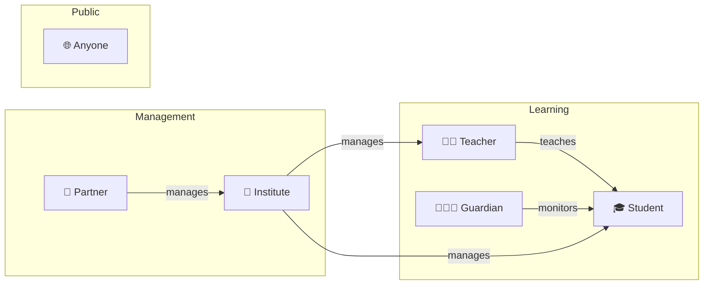

# What is TinkerBunker?

> A platform where schools, teachers, and students come together to learn and grow.

---

## What Can You Do Here?

| | Feature | Description |
|---|---|---|
| 📚 | **Courses** | Learn through chapters and pages — at your own pace |
| 📝 | **Tests** | Take quizzes, practice tests, and live remote quizzes |
| 🏫 | **Classrooms** | Get organized into classes with your teachers |
| 🏆 | **Certificates** | Earn a certificate when you complete a course |
| 📊 | **Progress Tracking** | See how you're doing with stats and leaderboards |
| 👨‍👩‍👧 | **Guardian Access** | Parents can monitor their child's learning |

---

## Who Uses TinkerBunker?

---

## How Do I Get Started?

| Your Situation | What To Do |
|---|---|
| I'm a **student or teacher** | [Sign up](signing-up.md) and pick your school |
| I'm a **parent/guardian** | [Sign up](signing-up.md) and link your child |
| I'm an **institute admin** | You'll receive an invite from your Partner |
| I'm a **partner** | You'll receive an invite from the Sales team |
| I just want to **browse** | Go to [Courses](../public/browsing-courses.md) — no login needed |

---

## Next Steps

→ [Create Your Account](signing-up.md)
→ [Log In](logging-in.md)
→ [Who Can Do What?](../features/role-access-matrix.md)
