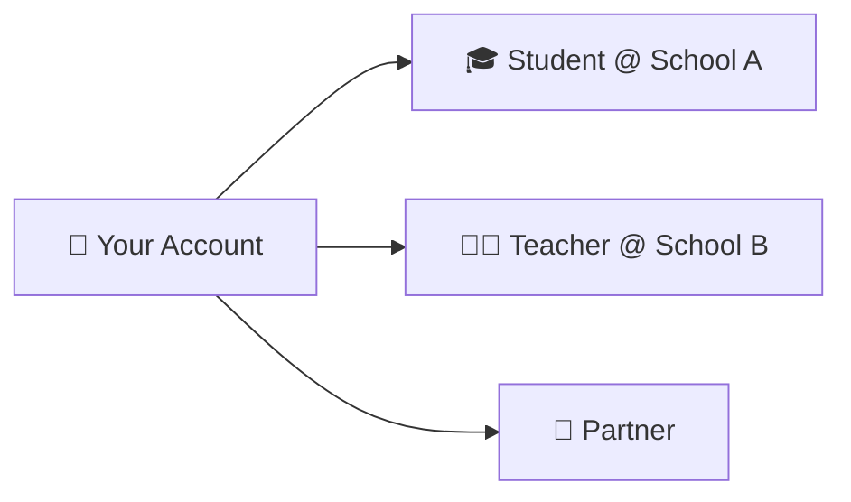

# Switch Roles

> One account, many roles. Switch between them in 3 clicks.

---

## How It Works

You can be a Student at one school and a Teacher at another — all from the same account. No need to log out.

---

## 3 Steps to Switch

1. 👤 Click your **profile picture** (top-right corner)
2. 🎭 Find the **Role Switcher** section
3. 🖱️ Click the role you want — page reloads and you're there


You'll only see roles that are active on your account. Pending roles show as "Pending Approval."


---

## What Changes When You Switch?

| | Before | After |
|---|---|---|
| 📊 | Old role's dashboard | New role's dashboard |
| 📋 | Old role's menu | New role's menu |
| 🔒 | Old role's permissions | New role's permissions |

Your data in each role stays separate and safe.

---

## Want More Roles?

| How | What You Get |
|---|---|
| [Join a school](joining-an-institute.md) | Student or Teacher role (needs approval) |
| Get invited by a Partner | Team member role |

---

## Next Steps

→ [Join a school](joining-an-institute.md)
→ [Back to overview](overview.md)
