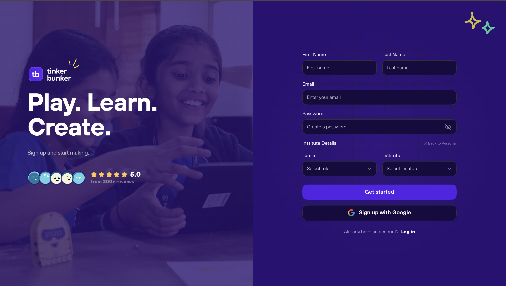

# Signing Up

TinkerBunker offers two signup modes: **Personal Signup** and **Institute Signup**. Both paths create a full user account, but the Institute flow also links you to a specific school or organization.

---

## Signup Modes




Personal signup creates a standalone account not linked to any institute.

### Steps

1. Navigate to the TinkerBunker signup page.
2. Select **Personal Signup**.
3. Fill in the required fields:
   - **Full Name** -- Your display name on the platform.
   - **Email Address** -- Must be unique across the platform.
   - **Password** -- Minimum 8 characters. Use a mix of letters, numbers, and symbols.
   - **Confirm Password** -- Must match the password field.
4. Click **Sign Up**.
5. A verification email is sent to the address you provided. Open the email and click the verification link or enter the OTP code.
6. Once verified, you are redirected to the login page.

<figure><figcaption><p>Personal signup form</p></figcaption></figure>


After personal signup, your account has no role assigned by default. You will be prompted to select or request roles once you log in.





Institute signup links your account to a specific school or organization and assigns you a role within that institute.

### Steps

1. Navigate to the TinkerBunker signup page.
2. Select **Institute Signup**.
3. Fill in the required fields:
   - **Full Name** -- Your display name on the platform.
   - **Email Address** -- Must be unique across the platform.
   - **Password** -- Minimum 8 characters.
   - **Confirm Password** -- Must match the password field.
4. Select your **role** within the institute:
   - **Student** -- You are joining as a learner.
   - **Teacher** -- You are joining as an educator.
5. Search for and select your **school or institute** from the dropdown list.
6. Click **Sign Up**.
7. A verification email is sent to your address. Verify your email using the link or OTP code.
8. After verification, your account enters a **Pending Approval** state. The institute administrator must approve your request before you can access institute resources.

<figure><figcaption><p>Institute signup form</p></figcaption></figure>


Institute signups require approval from the institute administrator. You will not have access to institute-specific classrooms, courses, or resources until your request is approved. You will receive a notification once your status changes.





---

## Google OAuth Signup

You can also create an account using your Google account. This skips the email verification step.

### Steps

1. Navigate to the signup page.
2. Click **Sign up with Google**.
3. Select your Google account from the OAuth prompt.
4. Google provides your name and email to TinkerBunker automatically.
5. If this is your first time, an account is created and you are redirected to the dashboard.
6. If an account with that email already exists, you are logged into the existing account.

<figure><figcaption></figcaption></figure>


Google OAuth can be used with both Personal and Institute signup flows. When using Google OAuth for Institute signup, you will still need to select your role and school after authentication.


---

## Email Verification

For email-and-password signups, verification is required before you can log in.

1. After submitting the signup form, check your inbox for a verification email from TinkerBunker.
2. Click the verification link in the email, or enter the OTP code on the verification screen.
3. Once verified, your account is active and you can proceed to [log in](logging-in.md).


If you do not receive the verification email within a few minutes, check your spam or junk folder. You can request a new verification email from the signup confirmation screen.


---

## Invitation-Only Roles

Not all roles can self-register. TinkerBunker uses a **top-down invitation chain** for organizational roles. Only the higher-level role can invite the next level:

```
Super Admin / Admin Publisher
  └── invites → Sales team members
        └── invites → Partners
              ├── invites → Institutes (Schools)
              └── invites → Sub-Partners
                    └── Institute approves → Students & Teachers
```


If you are a **Partner**, **Sales**, or **Institute** admin, you **cannot self-register**. You must receive an invitation from the role above you in the chain. Check your email for an invitation link.


### How Invitations Work

1. The inviting role (e.g., Sales) opens their management page and clicks **Invite**.
2. They enter your **name** and **email address** (or bulk-upload via Excel).
3. You receive an email with a signup/activation link.
4. Click the link, complete your profile, and you're onboarded into the platform with the correct role.



**Invited by:** Admin Publisher  
**How:** Admin Publisher goes to **Sales** page and sends an invitation with your name and email.  
**After accepting:** You can manage Partners and Teams.


**Invited by:** Sales team  
**How:** Sales member goes to **Partners** page and sends an invitation.  
**After accepting:** You can manage Schools, Sub-Partners, Teams, Seats, and Billing.


**Invited by:** Partner  
**How:** Partner goes to **Schools** page and sends an invitation with your institute name and email.  
**After accepting:** You can manage Classrooms, Teams, approve Students/Teachers, and view Stats.


**Invited by:** Partner  
**How:** Partner goes to **Sub-Partners** page and sends an invitation.  
**After accepting:** You operate as a scoped partner under the parent partner.



---

## Self-Registration vs Invitation Summary

| Role | How to Join | Approval Needed? |
| --- | --- | --- |
| **Public** | Self-register (Personal signup) | No |
| **Student** | Self-register (Institute signup) OR invited | Yes -- institute admin must approve |
| **Teacher** | Self-register (Institute signup) OR invited | Yes -- institute admin must approve |
| **Guardian** | Self-register + link to student | Student must accept linkage |
| **Institute** | Invitation only (from Partner) | No -- active on invite acceptance |
| **Partner** | Invitation only (from Sales) | No -- active on invite acceptance |
| **Sub-Partner** | Invitation only (from Partner) | No -- active on invite acceptance |
| **Sales** | Invitation only (from Admin Publisher) | No -- active on invite acceptance |
| **Admin Creator** | Internal assignment by Super Admin | N/A |
| **Admin Publisher** | Internal assignment by Super Admin | N/A |
| **Super Admin** | System-level -- no self-registration | N/A |

---

## What Happens After Signup?

| Signup Type | Verification | Approval Required | Access Level |
| --- | --- | --- | --- |
| Personal | Email verification | No | Public role -- browse courses |
| Personal + Google | Automatic | No | Public role -- browse courses |
| Institute (Student/Teacher) | Email verification | Yes (institute admin) | Pending until approved |
| Institute + Google | Automatic | Yes (institute admin) | Pending until approved |
| Invitation (Partner/Sales/Institute) | Link activation | No | Full role access on acceptance |

---

## Next Steps

- [Log in to your account](logging-in.md)
- [Join an institute after signup](joining-an-institute.md)
- [Switch between roles](role-switching.md)
- [Understanding the approval system](../features/approval-system.md)
