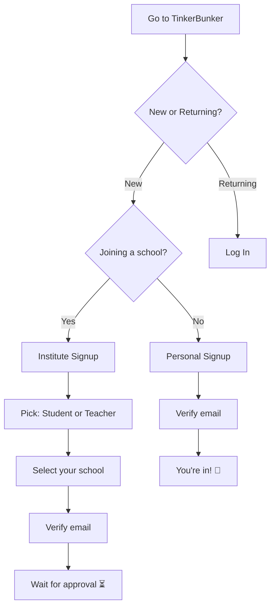

# Create Your Account

> Two ways to sign up — pick the one that fits you.

---

## How Signup Works

---

## Signup Modes




Personal signup = a standalone account, not linked to any school.

1. 📝 Enter your **name**, **email**, and **password**
2. 📧 Check your inbox and **verify your email**
3. ✅ Done — you're a Public user. Browse courses right away!


After signing up, you can join a school anytime from your profile.





Institute signup = join a specific school as a Student or Teacher.

1. 📝 Enter your **name**, **email**, and **password**
2. 🎭 Pick your role — **Student** or **Teacher**
3. 🏫 Search and select your **school**
4. 📧 Check your inbox and **verify your email**
5. ⏳ Wait for your school admin to **approve** you


You won't see classrooms or courses until your school approves you.





---

## 🔵 Google Signup (One Click)

1. 🖱️ Click **Sign up with Google**
2. ✅ Pick your Google account — done!

- Skips email verification entirely
- Works for both Personal and Institute signup
- If you pick Institute, you'll still choose your role and school after

---

## 📧 Email Verification

Only needed for email + password signups (not Google).

1. Open the email from TinkerBunker
2. Click the link or enter the **6-digit code**
3. You're verified!


No email? Check your spam folder. You can resend from the signup screen.


---

## 🔒 Invitation-Only Roles

Some roles can't self-register. They're invite-only:

| Role | Invited By |
|---|---|
| **Institute** | Partner |
| **Partner** | Sales team |
| **Sub-Partner** | Partner |

You'll get an email with a signup link. Click it, complete your profile, and you're in.

---

## Quick Summary

| Signup Type | Verification | Approval Needed? | You Get |
|---|---|---|---|
| Personal | Email | No | Public role — browse courses |
| Personal + Google | Automatic | No | Public role — browse courses |
| Institute (Student/Teacher) | Email | Yes — school admin | Access after approval |
| Institute + Google | Automatic | Yes — school admin | Access after approval |
| Invitation (Partner/Institute) | Link click | No | Full role access |

---

## Next Steps

→ [Log in to your account](logging-in.md)
→ [Join a school after signup](joining-an-institute.md)
→ [Switch between roles](role-switching.md)
