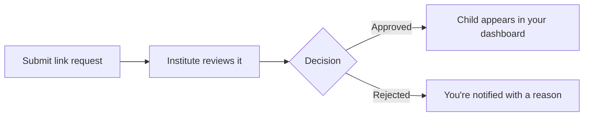

# 🔗 Link Your Child

Connect your child's account to start tracking their progress.

---

## 🔄 How It Works

---

## 📝 Steps

1. Go to **Link Student** from the sidebar.
2. Enter your child's name and student ID.
3. Submit the request.
4. Wait for the institute to approve.


You'll get a notification once the request is approved or rejected.

