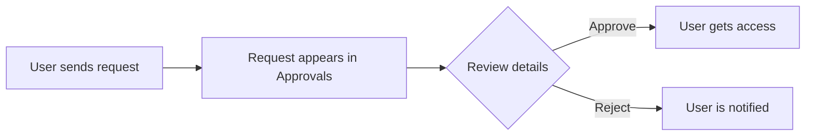

# ✅ Approve New Users

Review and respond to incoming user requests.

---

## 🔄 How It Works

---

## 📝 Steps

1. Go to **Approvals** from the sidebar.
2. Review the user's name, role, and details.
3. Click **Approve** or **Reject**.

---

## 📌 Quick Tips

- Approved users can immediately access the institute.
- Rejected users receive a notification with the reason.


You need the `approval_operation` flag to manage approvals.

