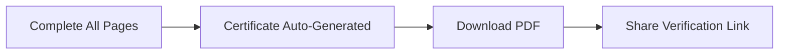

# 🏆 Earn Certificates

Complete a course. Get a certificate. Share it with the world.

---

## 📋 How It Works



1. **Finish every page** in a course that has certificates enabled.
2. Your certificate is **generated automatically** — no extra steps.
3. **Download the PDF** from the completed course or your certificates section.


Not all courses issue certificates — check the course detail page before enrolling.


<figure><figcaption></figcaption></figure>

---

## 🔗 Public Verification

Every certificate has a unique link:

```
https://tinkerbunker.com/verify/{UUID}
```

Anyone can visit that link to confirm your certificate is real.


Add your verification link to your resume or LinkedIn profile!


---

## ❓ Good to Know

- Certificates **never expire** and are always verifiable.
- Make sure your **profile name** is correct before finishing the course.
