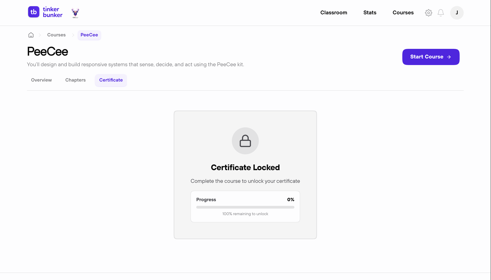

# Earn Certificates

---

## How It Works

1. Complete all chapters and pages in a course.
2. A certificate is generated automatically.
3. Download it as a PDF from your dashboard.

<figure><figcaption></figcaption></figure>

---

## Public Verification

Every certificate has a unique link. Anyone can verify it — no login needed.

Share the link or the certificate's QR code to prove completion.

→ [How certificate verification works](../features/certificates.md)


Certificates are only generated for fully completed courses.

