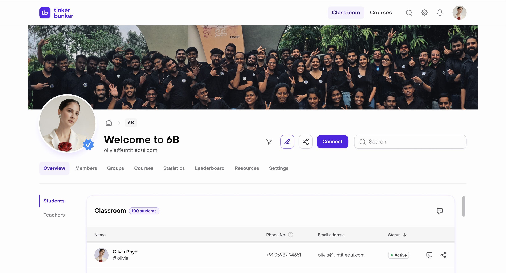

# 🏫 My Classroom

Click **Classroom** in the nav bar to see your class.

---

## 👀 What You'll See

| Section | What's There |
| ------------------- | ---------------------------------------- |
| **Teacher** | Your teacher's name. |
| **Classmates** | List of students in your class. |
| **Linked Courses** | Courses your teacher assigned to you. |
| **Assignments** | Tests and tasks with due dates. |


Your teacher adds you to a classroom — you can't join or leave on your own.


<figure><figcaption></figcaption></figure>
