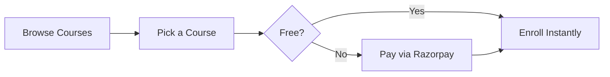

# 📚 Find & Enroll in Courses

---

## 🔍 3 Steps to Enroll

1. Click **Courses** in the nav bar.
2. Search or browse for a course you like.
3. Click **Enroll** (free) or **Enroll — ₹XXX** (paid).

That's it — the course appears in **My Courses** on your dashboard.

<figure><figcaption></figcaption></figure>

---

## 💰 Free vs Paid

| | Free | Paid |
| ------------- | ----------------------- | -------------------------------- |
| **Cost** | ₹0 | Price set by the creator |
| **Enroll** | Instant, one click | Pay first via Razorpay |
| **Payment** | None | UPI, Card, Net Banking, Wallets |


Payment failed? Don't retry right away — check your bank first. Refunds process in 5-7 days.


---

## 🔄 Enrollment Flow

---

## 🔒 Private Courses

Private courses don't show up in the catalog. You get access two ways:

- Your **teacher links it** to your classroom.
- Someone shares a **direct link** with you.


Private paid courses still require payment before you can access the content.

