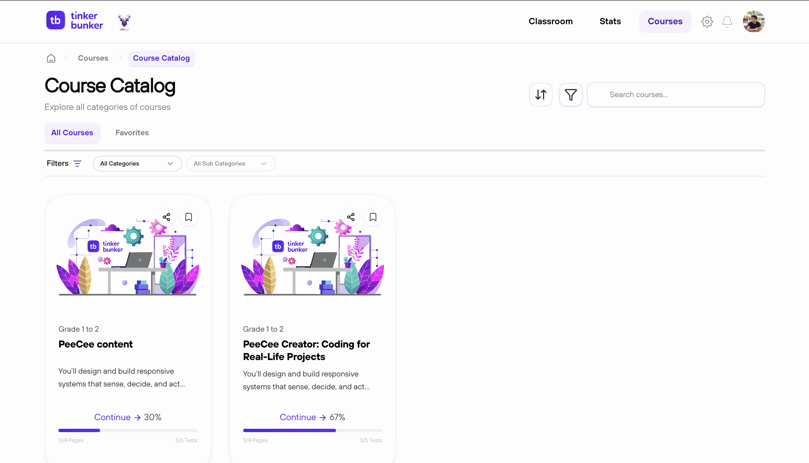

# Find & Enroll in Courses

---

## How to Enroll

1. Click **Courses** in the navigation bar.
2. Browse or search for a course.
3. Click **Enroll** for free courses, or complete payment for paid ones.

The course will appear in **My Courses** on your dashboard.

---

## Free vs Paid Courses

| | Free | Paid |
|---|---|---|
| **Cost** | Nothing | Price set by the creator |
| **Enrollment** | Instant | Pay via Razorpay first |
| **Payment Methods** | — | UPI, Card, Net Banking, Wallets |

---

## Private Courses

Private courses are not listed in the public catalog. You can access them when:

- Your teacher links the course to your classroom.
- Someone shares a direct link with you.


Payment issues? Check with your bank before retrying. Refunds take 5-7 business days.

