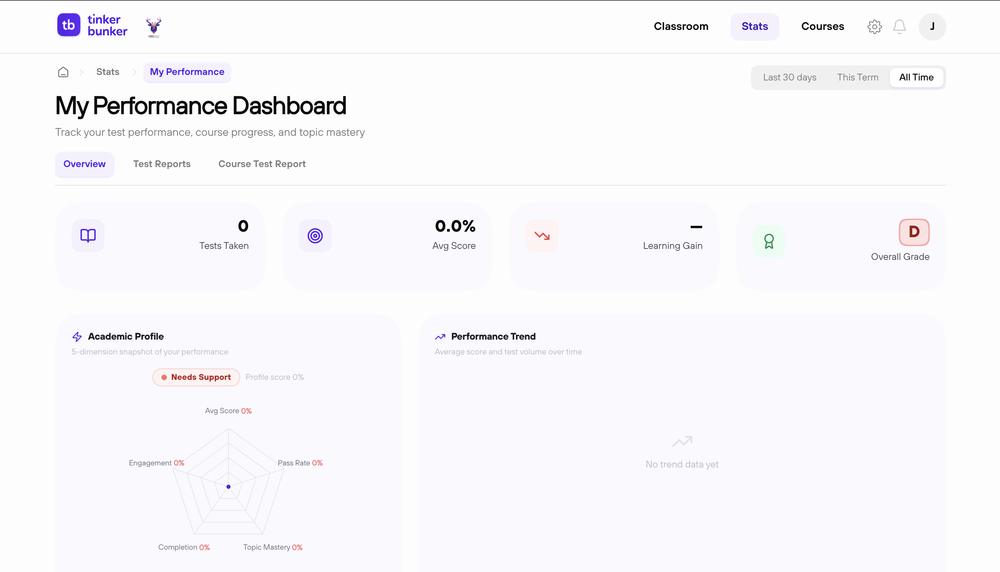

# 📊 Track Your Progress

Click **Stats** in the nav bar to see how you're doing.

<figure><figcaption></figcaption></figure>

---

## 📈 What's Tracked

| Stat | What It Shows |
| -------------------- | -------------------------------------------------- |
| **Progress** | % of courses and chapters you've completed. |
| **Proficiency** | How well you perform on tests (accuracy, scores). |
| **Concept Clarity** | Per-topic understanding based on test results. |
| **Growth Charts** | Visual graphs of your improvement over time. |
| **Leaderboard** | Your rank vs other students in your class. |

---

## 🎯 Concept Clarity Scores

| Score | Meaning |
| --------- | ----------------------- |
| 80 – 100 | Strong understanding. |
| 60 – 79 | Good, minor gaps. |
| 40 – 59 | Needs review. |
| 0 – 39 | Revisit the material. |


Concept scores update only after you take tests — not just by reading pages.


---

## 🏆 Leaderboard

- Ranked by overall performance across courses and tests.
- May be scoped to your classroom or the whole platform.
- Updates periodically as everyone progresses.


Use the leaderboard as motivation — but focus on your own growth!

