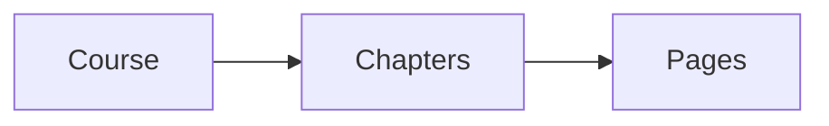

# 📖 Learn — Courses & Chapters

---

## 🗂️ How Courses Are Organized

Every course follows this simple structure:

| Level | Think of it as… |
| ----------- | ---------------------------------------- |
| **Course** | The whole book. |
| **Chapter** | A section or module. |
| **Page** | One lesson — text, images, or videos. |

---

## 🚀 Start Learning

1. Go to **My Courses** on your dashboard.
2. Click a course to open it.
3. Pick a chapter, then click a page to begin.
4. Use **Next / Previous** buttons to move between pages.


TinkerBunker remembers where you left off — just click the course to resume.


<figure><figcaption></figcaption></figure>

---

## 📊 Progress Tracking

| Indicator | What It Tells You |
| -------------------- | ---------------------------------------- |
| **Progress Bar** | Overall % of pages completed. |
| **Chapter ✓** | All pages in that chapter are done. |

- All chapters done → course complete → earn a certificate (if enabled).


Completed courses show a **Completed** badge. You can revisit them anytime.

