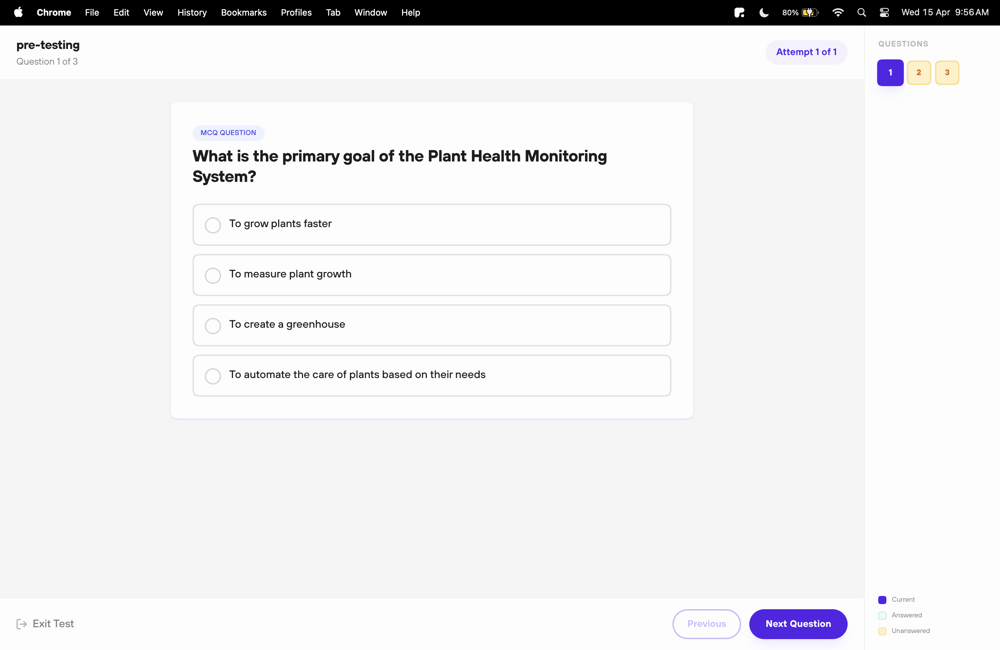

# 📝 Take Tests

---

## 🧪 Test Types

| Type | What It Is | Where to Find It |
| -------------- | ---------------------------------------- | -------------------------------- |
| **Assigned** | Your teacher assigns it. Has a deadline. | Dashboard → Upcoming / Classroom |
| **Practice** | Self-paced revision. Retake anytime. | Inside courses |
| **View-Only** | Review your past answers. No retakes. | Test history |


Assigned tests may be timed — complete them before the due date!


---

## ✅ How to Take a Test

1. **Find it** — Check **Upcoming** on your dashboard or open a course.
2. **Start it** — Click the test, then hit **Start Test**.
3. **Answer** — Pick your answers. Use **Flag** to mark tricky ones for later.
4. **Submit** — Hit **Submit**, confirm, and you're done.

<figure><figcaption></figcaption></figure>


Timed tests auto-submit when the clock hits zero. Keep an eye on the timer!


---

## 📊 After You Submit

| Test Type | What Happens |
| -------------- | -------------------------------------------------- |
| **Practice** | Results + correct answers shown right away. |
| **Assigned** | Results shown after teacher review (or instantly). |
| **View-Only** | Read-only view of your answers. |


Once submitted, answers can't be changed — double-check before confirming.

