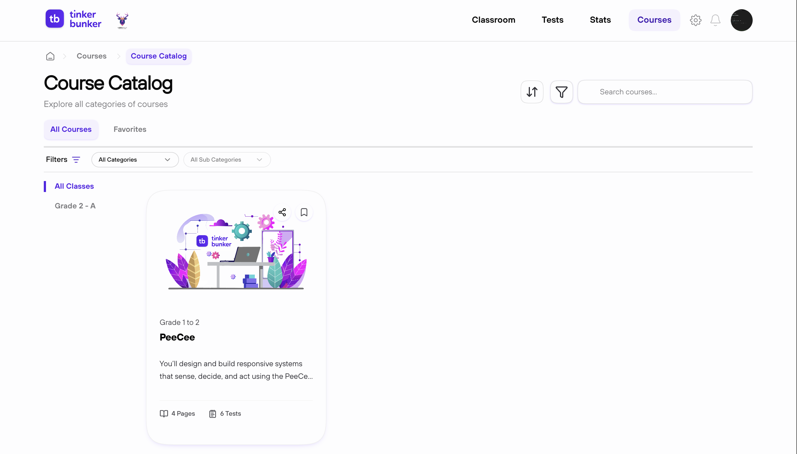

# 📚 Browse Courses

Find courses, preview them, and link them to your classrooms.

---

## 🔍 Find a Course

1. Click **Courses** in the nav bar
2. Search by title or keyword
3. Filter by category, visibility, or price

<figure><figcaption></figcaption></figure>

---

## 👁️ View Course Details

Click any course card to see:

| Field | Info |
| ----------- | ---------------------------------- |
| **Title** | Course name |
| **Chapters** | Chapter list with page counts |
| **Duration** | Estimated completion time |
| **Visibility** | Public or Private |
| **Price** | Free or paid (INR) |


Preview full course content before linking it to a classroom.


---

## ❤️ Favorite or Link

- Tap the **heart icon** to save a course to [Favorites](favorites.md)
- To link it to a classroom, see [Manage Classrooms](managing-classrooms.md)
