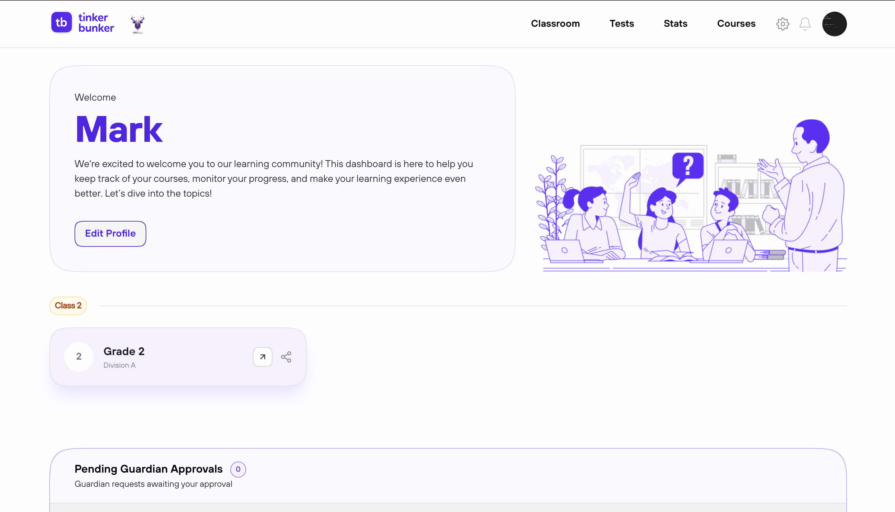

# Teacher Dashboard

The **Teacher Dashboard** is your command center on TinkerBunker. It gives you an at-a-glance view of your classrooms, recent activity, and quick access to all teaching tools.

<figure><figcaption></figcaption></figure>

---

## Dashboard Overview

When you log in as a teacher, the dashboard presents:

| Section | Description |
| ---------------------- | ------------------------------------------------------------------------------ |
| **My Classrooms** | A summary of all classrooms you manage, with student count and linked courses. |
| **Recent Activity** | Latest actions — new assignments, graded tests, quiz sessions. |
| **Upcoming** | Scheduled quizzes, assignment deadlines, and pending evaluations. |
| **Notifications** | Alerts for student submissions, system updates, and announcements. |

---

## Navigation Bar

The teacher navigation bar provides access to four main areas:

| Nav Item | Destination |
| ------------- | --------------------------------------------------------------------------- |
| **Classroom** | Manage your classrooms — create, edit, assign students, link courses. |
| **Courses** | Browse the course catalog, view course details, and favorite courses. |
| **Tests** | Create standalone tests, manage assignments, evaluate submissions, run remote quizzes. |
| **Stats** | View teaching statistics, student performance summaries, and analytics. |


The navigation bar is visible on every screen. You can always return to the dashboard by clicking the TinkerBunker logo.


---

## My Classrooms Summary

The dashboard shows a card for each classroom you manage. Each card includes:

- Classroom name
- Number of enrolled students
- Number of linked courses
- A quick link to open the classroom management page

---

## Recent Activity

A chronological feed of your recent teaching activities:

- Tests you created or edited
- Assignments you sent to students
- Tests you graded or evaluated
- Remote quiz sessions you conducted

---

## Upcoming

Time-sensitive items appear here:

| Item | Details |
| ----------------------- | ------------------------------------------------------------ |
| **Assignment Deadlines**| Tests assigned with due dates approaching. |
| **Pending Evaluations** | Student submissions awaiting your review and grading. |
| **Scheduled Quizzes** | Upcoming live remote quiz sessions. |


Pending evaluations require your attention. Students cannot see their grades until you complete the evaluation process.


---

## Quick Actions

From the dashboard, you can quickly:

1. **Create a Classroom** — Start setting up a new classroom immediately.
2. **Create a Test** — Jump to the test creation workflow.
3. **Assign a Test** — Select a test and assign it to students or classrooms.
4. **Start a Remote Quiz** — Launch a live quiz session.

<figure><figcaption></figcaption></figure>
