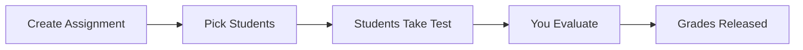

# 📋 Assign & Grade

Create an assignment, students take it, you evaluate. Simple.

---

## 🔄 The Flow

---

## ➕ Create an Assignment

1. Go to **Tests** → find your test → click **Assign**
2. Choose who gets it:

| Target | Meaning |
| ----------------------- | -------------------------------- |
| **Individual Students** | Hand-pick specific students |
| **Classroom** | All students in that classroom |
| **Multiple Classrooms** | Same test across several classes |

3. Set a **Due Date** (optional)
4. Add **Instructions** (optional)
5. Click **Assign**


Students added to a classroom later will also receive the assignment.


---

## 📊 Track Submissions

<figure><figcaption></figcaption></figure>

| Status | Meaning |
| --------------- | ---------------------------------- |
| **Not Started** | Student hasn't opened it yet |
| **In Progress** | Started but not submitted |
| **Submitted** | Done — ready for your review |
| **Evaluated** | You've graded it |

---

## ✅ Evaluate

- **Auto-graded:** MCQ, True/False, Fill-in-Blank — scored instantly
- **Manual:** Subjective answers — open the submission, award marks, add feedback

Click **Finalize Grade** to release results to the student.


Students won't see grades for manual questions until you finalize.

